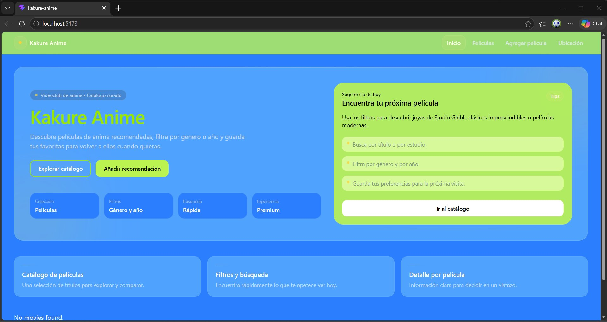
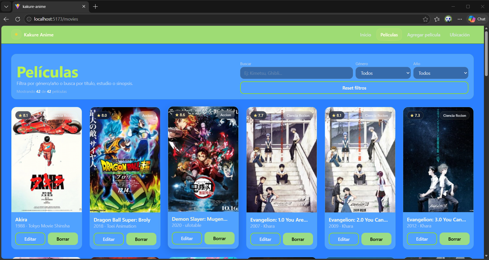
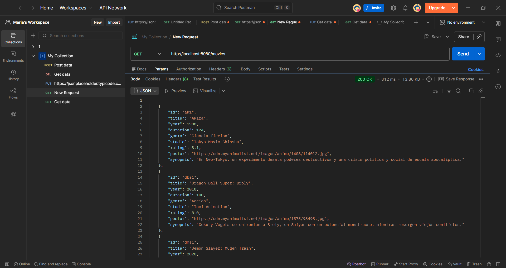
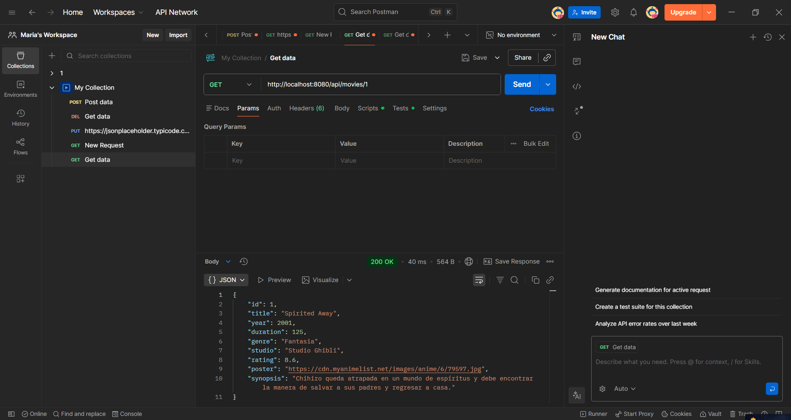

# 🎬 Kakure Videoclub

Aplicación fullstack de videoclub de anime con frontend en React y backend en Spring Boot conectado a una base de datos MySQL.

---

## 📸 Capturas de pantalla - Frontend

### Página de inicio


### Catálogo de películas


---

## 📸 Capturas de pantalla - Postman

### GET - Obtener todas las películas


### GET - Obtener película por ID


### GET - Obtener película por ID (detalle)


### DELETE - Eliminar película


---

## 🗂️ Estructura del proyecto

```
kakure-videoclub/
├── frontend/   → Aplicación React (Vite)
└── backend/    → API REST Spring Boot
```

---

## 🛠️ Tecnologías utilizadas

### Frontend
- React + Vite
- Axios
- React Router

### Backend
- Java 21
- Spring Boot 3.5
- Spring Data JPA
- Spring Web
- MySQL Driver

### Base de datos
- MySQL 8.0
- Base de datos: `kakureanime_spring`
- 42 películas de anime

---

## ⚙️ Instalación y ejecución

### Requisitos previos
- Node.js
- Java 21
- MySQL 8.0
- IntelliJ IDEA

### 1. Base de datos

Crea la base de datos en MySQL Workbench:

```sql
CREATE DATABASE kakureanime_spring;
USE kakureanime_spring;
```

### 2. Backend (Spring Boot)

Abre la carpeta `backend` en IntelliJ IDEA.

Configura `src/main/resources/application.properties`:

```properties
spring.datasource.url=jdbc:mysql://localhost:3306/kakureanime_spring
spring.datasource.username=root
spring.datasource.password=root
spring.datasource.driver-class-name=com.mysql.cj.jdbc.Driver
spring.jpa.hibernate.ddl-auto=none
spring.jpa.show-sql=true
```

Ejecuta la aplicación. El servidor arranca en:
```
http://localhost:8080
```

### 3. Frontend (React)

```bash
cd frontend
npm install
npm run dev
```

La aplicación arranca en:
```
http://localhost:5173
```

---

## 📡 Endpoints de la API

| Método | Endpoint | Descripción |
|--------|----------|-------------|
| GET | `/movies` | Obtener todas las películas |
| GET | `/movies/{id}` | Obtener una película por ID |
| POST | `/movies` | Crear una nueva película |
| PUT | `/movies/{id}` | Actualizar una película |
| DELETE | `/movies/{id}` | Eliminar una película |

---

## 📦 Modelo de datos - `Movie`

| Campo | Tipo | Descripción |
|-------|------|-------------|
| `id` | String | Identificador único |
| `title` | String | Título de la película |
| `year` | int | Año de lanzamiento |
| `duration` | int | Duración en minutos |
| `genre` | String | Género |
| `studio` | String | Estudio de producción |
| `rating` | double | Puntuación (ej: 8.5) |
| `poster` | String | URL del póster |
| `synopsis` | String | Sinopsis |

---

## 🏗️ Arquitectura MVC (Backend)

```
src/
└── com/kakure/kakureanime/
    ├── model/
    │   └── Movie.java           → Entidad JPA
    ├── repository/
    │   └── MovieRepository.java → Acceso a datos (JPA)
    ├── service/
    │   └── MovieService.java    → Lógica de negocio
    ├── controller/
    │   └── MovieController.java → Endpoints REST
    └── KakureanimeApplication.java
```

---

## 🧪 Testing con Postman

**GET todas las películas:**
```
GET http://localhost:8080/movies
```

**GET película por ID:**
```
GET http://localhost:8080/movies/ak1
```

**POST nueva película:**
```json
POST http://localhost:8080/movies
{
  "id": "test1",
  "title": "Test Movie",
  "year": 2024,
  "duration": 90,
  "genre": "Accion",
  "studio": "Test Studio",
  "rating": 7.5,
  "poster": "https://ejemplo.com/poster.jpg",
  "synopsis": "Una película de prueba."
}
```

**PUT actualizar película:**
```
PUT http://localhost:8080/movies/test1
```

**DELETE eliminar película:**
```
DELETE http://localhost:8080/movies/test1
```

---

## 👩‍💻 Autora

**Maria19761976**  
[GitHub](https://github.com/Maria19761976)
